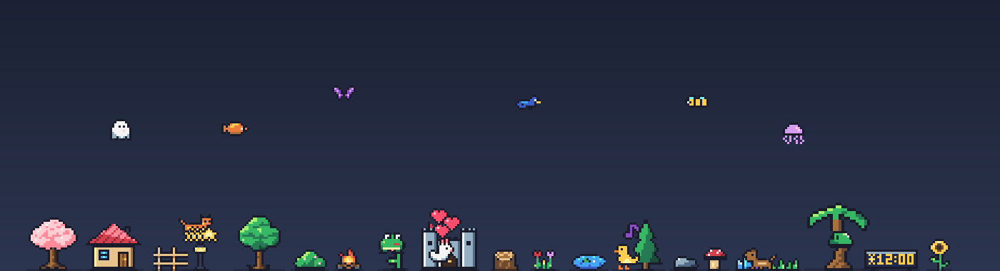
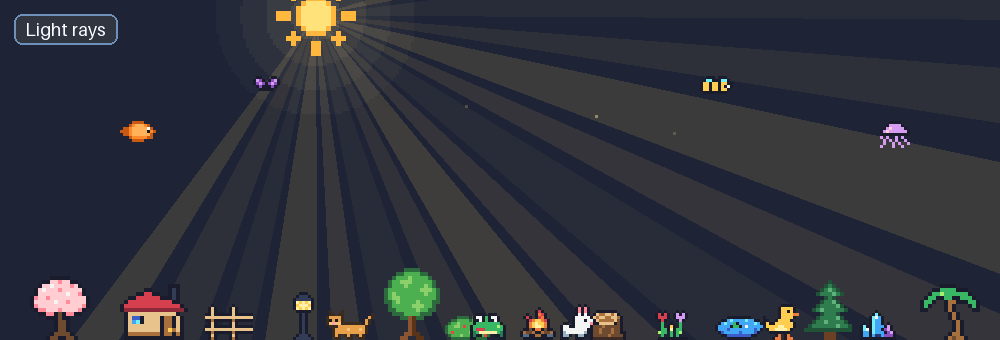
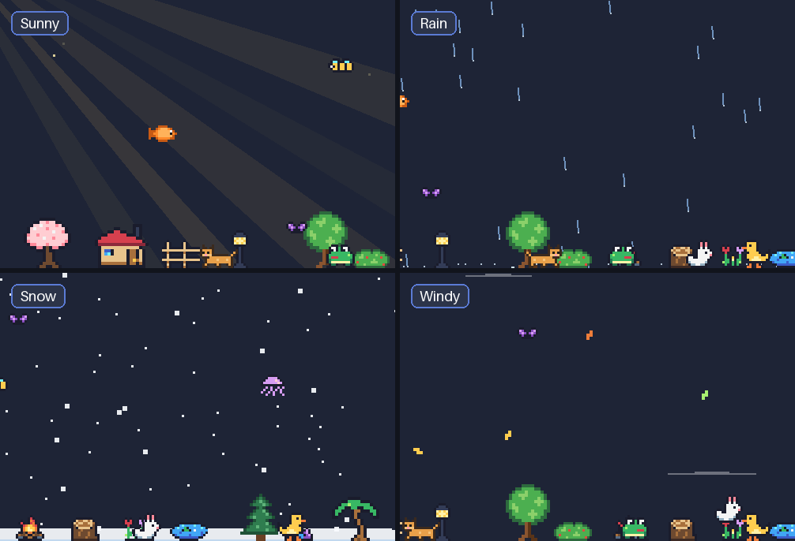
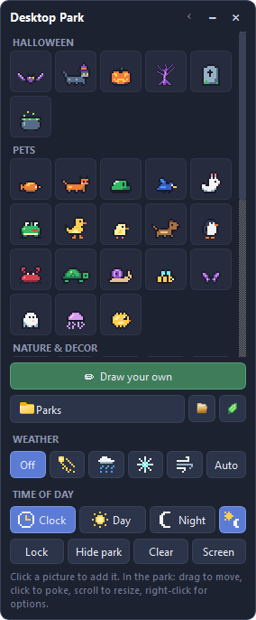
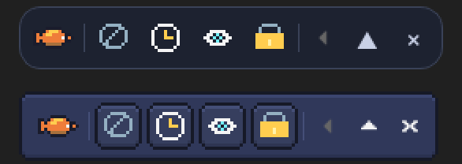
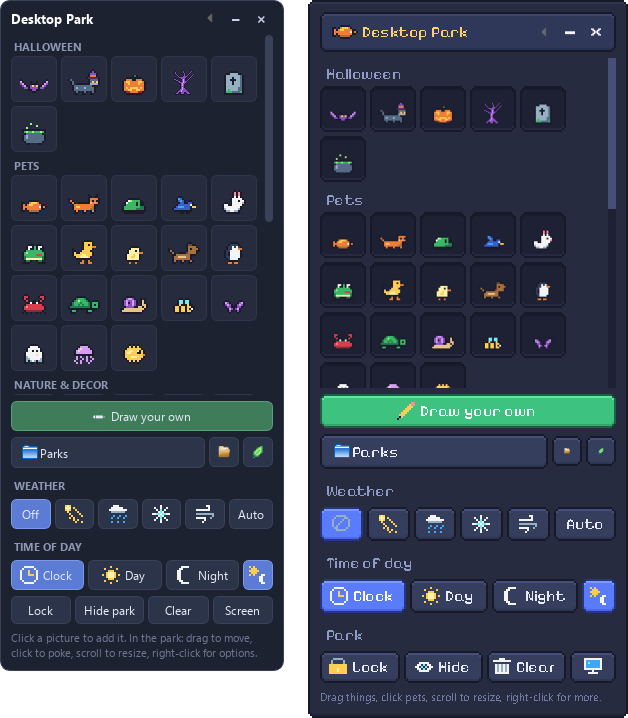
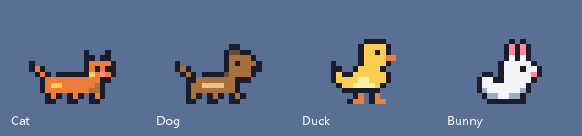

# Desktop Park

Little pixel-art pets and plants that live on top of your Windows screen.



The whole screen is the park, but it never gets in your way: clicks on empty
space go straight through to your apps. Only the pets and decorations
themselves can be grabbed. A small floating board lets you add things, draw
your own, change the weather, and lock or hide the park - and folds down into
a slim bar that fits inside your taskbar.

- **20 animated pets:** cat, dog, bunny, frog, duck, chick, penguin, crab,
  turtle, snail, bee, butterfly, bird, fish, ghost, jellyfish, pufferfish,
  slime, and for Halloween a bat and a witch cat
- **31 decorations:** trees, flowers, a cottage, a campfire, a pond, crystals, a clock,
  and for Halloween a jack-o'-lantern, a spooky tree, a gravestone and a cauldron
- **Draw your own** pets and decorations, with animation frames
- **Saved parks:** keep named arrangements and switch between them
- **Undo** park edits, and import or export drawings to share them
- **Low power:** fewer movement and weather updates, without slowing time
- **Any picture can walk, hop, swim, fly or stay still** - your choice
- **Weather:** sun rays, rain, snow that piles up, or wind that blows leaves
  (and your flying pets) around - or let it change by itself
- **Day & night:** a pixel sun and moon cross the top of your screen with the
  real time; at sunset the park turns warm, then moonlit; lamps and fires glow,
  fireflies come out, and the pets gather by the fire and doze off
- **Clock:** a little pixel clock decoration that shows the real time
- **Taskbar bar:** fold the board into a slim bar with weather, hide and
  lock buttons, and keep it in the Windows taskbar
- **Two looks:** clean **Modern**, or **Pixel** to match the art
- **Two or more monitors:** choose which screen the park lives on

## Weather



Your desktop gets its own sky. Pick the weather on the board, or press
**Auto** and let it change by itself every few minutes.

- **Light rays** - soft beams shining down from the sun with drifting sparkles;
  at night they turn into silver moonbeams from the moon
- **Rain** - grey clouds roll in along the top of the screen and pixel raindrops
  fall from them, slanted by the breeze, splashing when they land. The sun or
  moon peeks dimly through the clouds.
- **Snow** - soft pale clouds, and flakes that drift down and **pile up along
  the bottom of your screen**, then melt away when the snow stops
- **Windy** - a few white clouds race past, leaves and gusts blow across, and
  your flying and swimming pets get pushed around



The weather never gets in your way: it lives in its own window that every
click passes straight through. Clouds gather and clear over a few seconds when the weather changes,
and turn dark blue-grey at night.

## Day & night


The park follows your computer's clock (the picture above is a sped-up
evening):

- **The sun and moon move.** A pixel sun rises in the left corner of your
  screen in the morning, arcs across the top and sets in the right corner in
  the evening. It is small and low in the corners and biggest at its peak, where
  it only peeks in half-way from the top edge, so it never takes much room; then the moon does the same overnight, with a few twinkling
  stars. With **Light rays** on, the beams shine from the sun by day and the
  moon by night.
- **The park changes colour.** At sunset the pets and plants take on a warm
  glow, then cool moonlight. Things near a lamp or fire stay bright.
- **Lights glow** - lamp posts, the campfire, the cottage window, crystals,
  the clock, and the Halloween jack-o'-lanterns and cauldron. Fire flickers.
- **Fireflies** drift near the ground on dry nights.
- **Pets get cosy.** Walking pets wander over to the nearest campfire or lamp
  and doze off beside it (Zzz) - click one to wake it. Bees, butterflies and
  bats flutter around the lights like moths.
- **The clock** decoration (on the board with the other decorations) shows the
  real time, with a sun or moon next to it.

It never darkens your screen - only the park itself changes. To see night any
time, use the **Time of day** buttons on the board: **Clock** (follow my clock,
the default), **Day** or **Night**. The little sun-and-moon button next to them
shows or hides the sky. The same choices are on the folded bar (the clock
button) and in the tray menu.

**Halloween:** a bat, a witch cat, jack-o'-lanterns, a spooky tree, a
gravestone and a bubbling cauldron are on the board all year. In October
they move to the top.

## Download

**[Download the latest Windows release](https://github.com/sirawitbm/desktop-park/releases/latest)**

- `DesktopPark-vX.Y.Z-Setup.exe` - the normal install. Adds Desktop Park to
  the Start menu, no administrator access needed.
- `DesktopPark-vX.Y.Z-windows-x64.zip` - portable. Extract the whole folder,
  then run `DesktopPark.exe`; it keeps your park inside that folder.

Windows SmartScreen may warn about the app because releases are not digitally
signed. Download only from this repository, check the SHA-256 file next to
each download, and scan it with Microsoft Defender if you like. You can also
run it from source (below).

## How to use it



- **Add things:** click a picture on the board.
- **Move:** drag anything in the park. Pets dropped in the air fall back down.
- **Poke:** click a pet and it reacts in a random way: hearts, a big jump
  with stars, a spin, a surprised shake, a little dance with music notes,
  a nap (Zzz), or it runs away sweating. Decorations don't react.
- **Resize:** scroll the mouse wheel over a thing.
- **Options:** right-click a thing to change how it moves, its size, turn it
  around, bring it to the front, copy, edit or remove it.
- **Undo:** the back-arrow in the board title bar, the tray menu, or
  **Ctrl+Z** while the board has focus restores the last park edit. Up to
  40 edits are kept for this session, including loading a saved park.
- **Parks:** save the current arrangement with a name. Each saved park's
  menu offers Load, Rename and Delete. Weather and time-of-day settings
  are saved too; positions adapt to the current monitor.
- **Low power:** toggle the leaf button beside Parks (or Low power in the
  tray). Movement runs at about 15 updates per second and weather at 10,
  instead of 30 and 20. Animation time and auto-weather timing stay the same.
- **Weather:** the buttons under WEATHER on the board: Off, Light rays, Rain,
  Snow, Windy, and **Auto** to let it change by itself every few minutes.
  Also in the tray menu and on the folded bar. Weather never catches the mouse.
- **Time of day:** **Clock** follows your computer's clock; **Day** and
  **Night** keep it that way. The sun-and-moon button shows or hides the sky.
- **Two monitors?** Press **Screen** on the board (or **Screen** in the tray
  menu) and pick where the park lives. Everything keeps its place, pets on
  the ground stay on the ground, and the choice is remembered. If that
  monitor is unplugged, the park moves to your main screen and comes back
  when you plug it in again.
- **Lock:** clicks go through everything, even the pets. Good for gaming.
- **Hide park / Show park:** hides the whole park (and its weather). Also on
  the folded bar and in the tray menu (the fish icon by the clock).
- **Fold the board** with the "-" button in its title bar. It becomes a slim
  bar that fits **inside the Windows taskbar** - drag it there by the
  fish. Its bottom edge stays put, so the arrow button opens the board
  upward again. The "x" button hides the board into the tray icon.

<br clear="right">



**Two looks:** right-click the fish in the tray and pick **Look > Modern** (the
default) or **Look > Pixel**, a modern pixel-art style with a pixel font that
matches the pets. It switches right away and is remembered.



**Saving:** drawings are written immediately when you press Save. If a write
fails, the editor stays open and the board shows **Changes not saved** with
a Retry button (a **!** button on the folded bar). The warning clears only
after a successful save. Quitting from the tray does not exit while a save
fails.

**Updates:** Desktop Park checks GitHub for a new version a few seconds after
it starts and every 6 hours. If there is one, a green bar appears on the
board (a small green **New!** button on the folded bar) and in the tray
menu: **Get it** opens the download page, **Later** stays quiet about that
version. It only reads the version number - nothing
is downloaded or installed by itself.

Games need to run in **borderless windowed** mode for the park to show on top
of them. Exclusive fullscreen covers everything.

## Draw your own


Press **Draw your own** on the board, or right-click any built-in picture and
pick **Draw my own version** to start from a copy.

- Left button paints, right button erases. Pen, eraser, fill and colour picker.
- Choose **Pet** or **Decoration**, and how it moves.
- Add up to 6 **animation frames**. They play at 10 frames per second while
  it moves, and the previous frame shows faintly to help you line things up.
- Draw it **facing right** - it turns around by itself.
- Closing a changed drawing asks whether to Save, Discard or Cancel.

Your drawings show up under **My drawings** on the board.

**Share drawings:** right-click a picture on the board and choose **Export
drawing** to write a `.parkart` file. The folder button beside Parks imports
one. Imported drawings receive a new ID, so importing the same file twice
creates independent copies. Drawing files contain the palette, animation
frames and movement choice, not your whole park or personal settings.
Built-in blink/sleep poses are not part of editable drawing files.

Cat, dog and duck now have four-frame walks. They and the bunny blink while
resting and have a sleeping pose; other pets keep their existing cycles.



## Run from source

Needs Python 3.10+ on Windows.

```
pip install -r requirements.txt
pythonw desktop_park.py
```

Or double-click `Desktop Park.bat`. Run the tests with
`python -m unittest discover -s tests`.

The README pictures are rendered off-screen (install Pillow first,
`pip install pillow`): `python tools/screenshots.py docs/polish` for the board,
editor and park, `python tools/weather_demo.py` and `python tools/night_demo.py`
for the weather and night animations. `python tools/contact_sheets.py <folder>`
draws every sprite, icon and cloud for design reviews, and
`python tools/profile_weather.py` times off-screen 1080p/4K weather rendering
(it does not measure native Windows GPU/compositor costs).

Where your park is saved: `local/park.json` from source, `data/` next to the
exe for the portable zip, `%LOCALAPPDATA%\DesktopPark` for the installed app.

## How it works

| File | What it does |
|---|---|
| `desktop_park.py` | Starts everything, saving, the tray icon |
| `park.py` | The see-through full-screen window, mouse, right-click menu |
| `sim.py` | How things move and react (pure logic, unit tested) |
| `weather.py` | Rain, snow, wind, sun and fireflies (pure logic, unit tested) |
| `daycycle.py` | How dark it is from the clock, and Halloween season |
| `weather_window.py` | Draws the weather in its own click-through window |
| `updates.py` | Asks GitHub whether a newer version is out |
| `tools/weather_demo.py`, `tools/night_demo.py` | Render the README's weather and night pictures off-screen |
| `board.py` | The floating control board |
| `editor.py` | The pixel editor |
| `art.py`, `art_pack.py` | The built-in pixel art, written as rows of letters |
| `sprites.py` | Turns the art into images |
| `store.py` | Saves and loads the park safely (with a backup copy) |
| `ui_style.py` | The two looks (Modern and Pixel): colours, fonts, pixel frames |
| `assets/fonts/` | The pixel font and its license |

The park is a frameless, see-through, always-on-top window. Windows passes
clicks on fully transparent pixels through to whatever is underneath, so only
the painted pixels of a pet or plant catch the mouse. Lock mode adds
`WS_EX_TRANSPARENT`, so every click goes through. The weather lives in a
second window that always has it, so a raindrop can never catch a click.

## Credits

**Inspiration** (ideas only - no code or art was used from these): classic
desktop pets like Shimeji, eSheep and Desktop Goose. The floating control
board is modelled on my earlier app,
[Kanban Overlay](https://github.com/sirawitbm/kanban-overlay).

**Font:** the Pixel look uses [Pixelify Sans](https://github.com/eifetx/Pixelify-Sans)
by the Pixelify Sans Project Authors, under the SIL Open Font License 1.1.

**Colours:** the newer built-in art uses a palette built partly on
[Sweetie 16](https://lospec.com/palette-list/sweetie-16) by GrafxKid. The
editor's first 16 colours are the [PICO-8](https://www.lexaloffle.com/pico-8.php)
palette by Lexaloffle Games.

**Art:** all pixel art in this repository was drawn for this project.

**Built with** [Qt for Python (PySide6)](https://www.qt.io/qt-for-python) and
packaged with [PyInstaller](https://pyinstaller.org/). Made with help from
[Claude Code](https://claude.com/claude-code).

The licenses of the bundled software are listed in
[THIRD-PARTY-NOTICES.md](THIRD-PARTY-NOTICES.md).

## License

Desktop Park is released under the [MIT License](LICENSE). You can use,
change and share it, including the built-in art, as long as you keep the
copyright notice.
