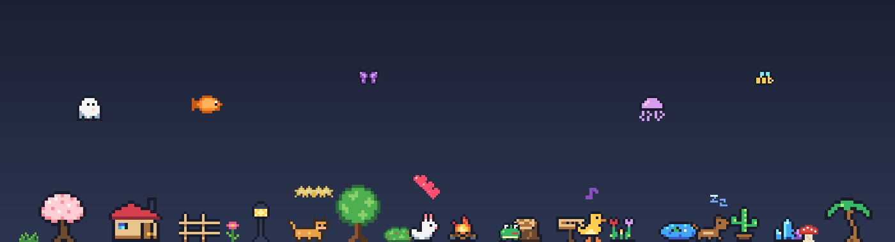
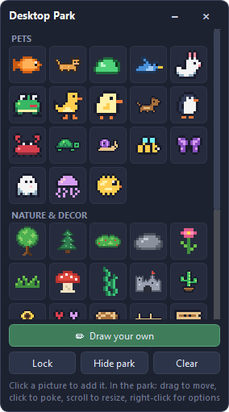
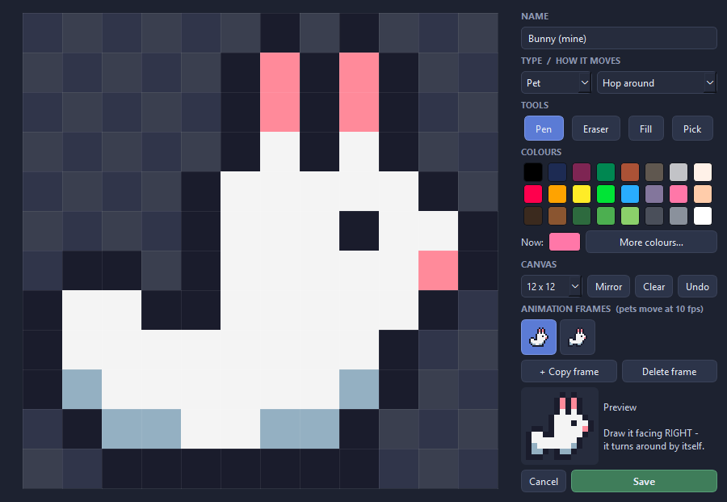

# Desktop Park

Little pixel-art pets and plants that live on top of your Windows screen.



The whole screen is the park, but it never gets in your way: clicks on empty
space go straight through to your apps. Only the pets and decorations
themselves can be grabbed. A small floating board lets you add things, draw
your own, and lock or hide the park.

- **18 animated pets:** cat, dog, bunny, frog, duck, chick, penguin, crab,
  turtle, snail, bee, butterfly, bird, fish, ghost, jellyfish, pufferfish, slime
- **26 decorations:** trees, flowers, a cottage, a campfire, a pond, crystals and more
- **Draw your own** pets and decorations, with animation frames
- **Any picture can walk, hop, swim, fly or stay still** - your choice

## Download

**[Download the latest Windows release](https://github.com/sirawitbm/destop-park/releases/latest)**

- `DesktopPark-v0.1.0-Setup.exe` - the normal install. Adds Desktop Park to
  the Start menu, no administrator access needed.
- `DesktopPark-v0.1.0-windows-x64.zip` - portable. Extract the whole folder,
  then run `DesktopPark.exe`; it keeps your park inside that folder.

Windows SmartScreen may warn about the app because releases are not digitally
signed. Download only from this repository, check the SHA-256 file next to
each download, and scan it with Microsoft Defender if you like. You can also
run it from source (below).

## How to use it



- **Add things:** click a picture on the board.
- **Move:** drag anything in the park. Pets dropped in the air fall back down.
- **Poke:** click a pet and it reacts in a random way: hearts, a big jump
  with stars, a spin, a surprised shake, a little dance with music notes,
  a nap (Zzz), or it runs away sweating. Decorations don't react.
- **Resize:** scroll the mouse wheel over a thing.
- **Options:** right-click a thing to change how it moves, its size, turn it
  around, bring it to the front, copy, edit or remove it.
- **Lock:** clicks go through everything, even the pets. Good for gaming.
- **Hide park / Show park:** on the board, or from the tray icon (the fish by
  the clock).
- The board's "-" folds it down; "x" hides it into the tray icon.

Games need to run in **borderless windowed** mode for the park to show on top
of them. Exclusive fullscreen covers everything.

<br clear="right">

## Draw your own



Press **Draw your own** on the board, or right-click any built-in picture and
pick **Draw my own version** to start from a copy.

- Left button paints, right button erases. Pen, eraser, fill and colour picker.
- Choose **Pet** or **Decoration**, and how it moves.
- Add up to 6 **animation frames**. They play at 10 frames per second while
  it moves, and the previous frame shows faintly to help you line things up.
- Draw it **facing right** - it turns around by itself.

Your drawings show up under **My drawings** on the board.

## Run from source

Needs Python 3.10+ on Windows.

```
pip install -r requirements.txt
pythonw desktop_park.py
```

Or double-click `Desktop Park.bat`. Run the tests with
`python -m unittest discover -s tests`.

Where your park is saved: `local/park.json` from source, `data/` next to the
exe for the portable zip, `%LOCALAPPDATA%\DesktopPark` for the installed app.

## How it works

| File | What it does |
|---|---|
| `desktop_park.py` | Starts everything, saving, the tray icon |
| `park.py` | The see-through full-screen window, mouse, right-click menu |
| `sim.py` | How things move and react (pure logic, unit tested) |
| `board.py` | The floating control board |
| `editor.py` | The pixel editor |
| `art.py`, `art_pack.py` | The built-in pixel art, written as rows of letters |
| `sprites.py` | Turns the art into images |
| `store.py` | Saves and loads the park safely (with a backup copy) |

The park is a frameless, see-through, always-on-top window. Windows passes
clicks on fully transparent pixels through to whatever is underneath, so only
the painted pixels of a pet or plant catch the mouse. Lock mode adds
`WS_EX_TRANSPARENT`, so every click goes through.

## Credits

**Inspiration** (ideas only - no code or art was used from these): classic
desktop pets like Shimeji, eSheep and Desktop Goose. The floating control
board is modelled on my earlier app,
[Kanban Overlay](https://github.com/sirawitbm/kanban-overlay).

**Colours:** the newer built-in art uses a palette built partly on
[Sweetie 16](https://lospec.com/palette-list/sweetie-16) by GrafxKid. The
editor's first 16 colours are the [PICO-8](https://www.lexaloffle.com/pico-8.php)
palette by Lexaloffle Games.

**Art:** all pixel art in this repository was drawn for this project.

**Built with** [Qt for Python (PySide6)](https://www.qt.io/qt-for-python) and
packaged with [PyInstaller](https://pyinstaller.org/). Made with help from
[Claude Code](https://claude.com/claude-code).

The licenses of the bundled software are listed in
[THIRD-PARTY-NOTICES.md](THIRD-PARTY-NOTICES.md).

## License

Desktop Park is released under the [MIT License](LICENSE). You can use,
change and share it, including the built-in art, as long as you keep the
copyright notice.
